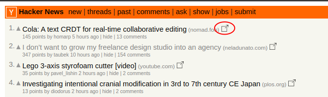

# Hacker News - Saved You A Click

I have been learning browser extension development. As my first project I developed this little extension that puts an extra icon on the Hacker News page to open both the article link and comments link in the background. I found myself opening both pages frequently and this speeds up reading a fair bit for me.

No ads, no tracking, no behind-the-scence snooping. Open source and free to use! Comments welcome.

Icons by <a target="_blank" href="https://icons8.com">Icons8</a>.
